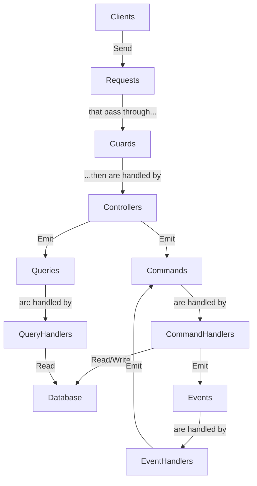

# RuneBingo API

REST API for RuneBingo, an application that lets Old School RuneScape players create and manage bingo events.

## Architecture

This project is built using the [NestJS](https://nestjs.com/) framework, implementing the [CQRS](https://docs.nestjs.com/recipes/cqrs) pattern. It uses [TypeORM](https://typeorm.io/) as the ORM and [PostgreSQL](https://www.postgresql.org/) as the main database.

Controllers receive HTTP requests and send commands and queries to the appropriate bus. Commands and queries are then handled by their corresponding handlers, which read from or write to the database. Commands may also emit events, which are handled by their corresponding handlers. Events can then cause side effects, such as executing commands for sending emails, creating activities or notifications, etc.



## Pre-requisites

- [Node.js](https://nodejs.org/en/)
- [Docker](https://www.docker.com/)

## Project setup

Install dependencies

```bash
npm install
```

Copy the `.env.example` file to `.env` and fill in the necessary values.

```bash
cp .env.example .env
```

## Database setup

This project uses Redis as a session store, as well as for caching and temporary code storage. It also uses PostgreSQL as the main database.

To start the databases, run the following command:

```bash
docker-compose up -d
```

The script located at `./scripts/db-setup.sh` will automatically create the additional database needed for testing.

Then, run the migrations to set up the database schema:

```bash
npm run migrate
```

## Compile and run the project

```bash
# development
npm run start

# watch mode
npm run start:dev

# production mode
npm run start:prod
```

## Run tests

```bash
# unit tests
npm run test

# e2e tests
npm run test:e2e

# test coverage
npm run test:cov
```

## Managing the Database

The database is controlled via the TypeORM CLI. Since the entity files are written in TypeScript and compiled using CommonJS, the CLI must be run using the alias `typeorm-ts-node-commonjs`, as specified in the `package.json` file.

### Running Database Migrations

Apply all pending migrations to the database:

```sh
npm run migrate
```

### Reverting the Last Migration

Revert the last migration that was applied to the database:

```sh
npm run db:migration:revert
```

### Generating a New Migration

> [!TIP]
> This will compare the current state of the database with the entities in the project and generate a new migration file based on the differences.

If you have made changes to your TypeORM entities and need to create a migration for them:

```sh
npm run db:migration:generate src/db/migrations/<Name>
```

### Creating an Empty Migration

If you want to create a fresh migration file, without any changes to the database:

```sh
npm run db:migration:create src/db/migrations/<Name>
```

### Dropping the Database

> [!WARNING]
> This will **permanently delete** all your data. This action cannot be undone.

```sh
npm run db:drop
```

### Resetting the Database

This will drop the database, recreate it, and apply all migrations:

```sh
npm run db:reset
```
