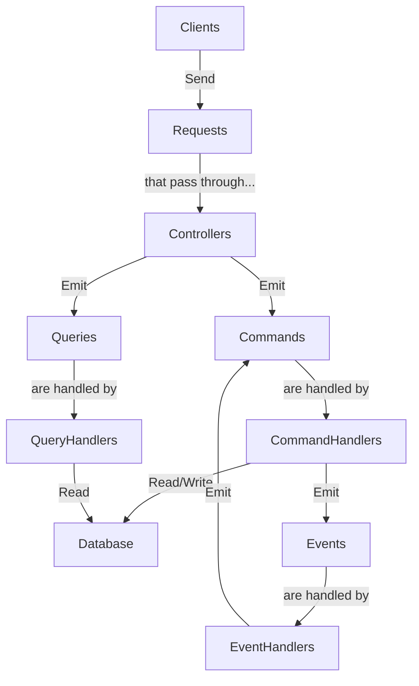

# API

REST API for RuneBingo, an application that lets Old School RuneScape players create and manage bingo events.

## Architecture

This project is built using the [NestJS](https://nestjs.com/) framework, implementing the [CQRS](https://docs.nestjs.com/recipes/cqrs) pattern. It uses [TypeORM](https://typeorm.io/) as the ORM and [PostgreSQL](https://www.postgresql.org/) as the main database.

Controllers receive HTTP requests and send commands and queries to the appropriate bus. Commands and queries are then handled by their corresponding handlers, which read from or write to the database. Commands may also emit events, which are handled by their corresponding handlers. Events can then cause side effects, such as executing commands for sending emails, creating activities or notifications, etc.



## Pre-requisites

- [Node.js](https://nodejs.org/en/)
- [Docker](https://www.docker.com/), or:
  - [PostgreSQL](https://www.postgresql.org/)
  - [Redis](https://redis.io/)

## Configuration

The configuration will be read by Nest.js in this order:

1. `.env` file in the root of the repository.
2. `config.json` file in the root of this project.
3. `config.local.json` file in the root of this project. This file is git-ignored and should be used for storing sensitive information such as API keys, or locally specific configuration values since it will override the values in `config.json`.

Refer to the [repository's README](../README.md) for a list of environment variables that need to be set in `.env`.

Both `config.json` and `config.local.json` follow the same schema. Please refer to the type definition and default values in [src/config.ts](src/config.ts) for more information.

## Database setup

This project uses Redis as a session store, as well as for caching and temporary code storage. It also uses PostgreSQL as the main database.

The databases should be started prior to running the application. Then, run the migrations to set up the database schema:

```bash
npm run migrate
```

## Compile and run the project

```bash
# development
npm run start

# watch mode
npm run start:dev

# production mode
npm run start:prod
```

## Run tests

```bash
# unit tests
npm run test

# e2e tests
npm run test:e2e

# test coverage
npm run test:cov
```

## Managing the Database

> [!IMPORTANT]
> For the database commands to work, they must be run from `/api`, not from the root of the repository.

The database is controlled via the TypeORM CLI. Since the entity files are written in TypeScript and compiled using CommonJS, the CLI must be run using the alias `typeorm-ts-node-commonjs`, as specified in the `package.json` file.

### Running Database Migrations

Apply all pending migrations to the database:

```sh
npm run migrate
```

### Reverting the Last Migration

Revert the last migration that was applied to the database:

```sh
npm run db:migration:revert
```

### Generating a New Migration

> [!TIP]
> This will compare the current state of the database with the entities in the project and generate a new migration file based on the differences.

If you have made changes to your TypeORM entities and need to create a migration for them:

```sh
npm run db:migration:generate src/db/migrations/<Name>
```

### Creating an Empty Migration

If you want to create a fresh migration file, without any changes to the database:

```sh
npm run db:migration:create src/db/migrations/<Name>
```

### Dropping the Database

> [!WARNING]
> This will **permanently delete** all your data. This action cannot be undone.

```sh
npm run db:drop
```

### Resetting the Database

This will drop the database, recreate it, and apply all migrations:

```sh
npm run db:reset
```

## CLI Commands

The RuneBingo API also provides CLI commands for managing the application.

### Seeding the Database

To seed the database with data, run the following command:

```sh
npm run db:seed
```

> [!CAUTION]
> This command should only be run in development environments, as it will add/overwrite existing data and cannot be undone.

This will add seeding data to the database from the `src/db/seeding/seeds/development` directory. You don't need to reset the database before seeding it, as it will automatically overwrite any existing data with the updated seed data.
