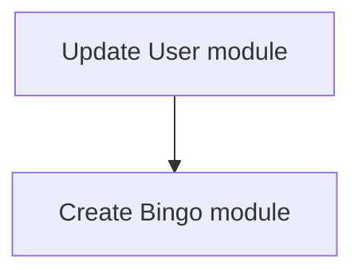

# RuneBingo MVP

[](https://github.com/RuneBingo/RuneBingo/issues/11)

As a bingo organizer, I want to be able to create an event, setup its description and tiles, invite people, create and manage teams, approve or reject tile completion requests, start and end the event.

## Table of Contents

- [Requirements](#requirements)
- [Specifications](#specifications)
  - [Entities](#entities)
  - [Commands](#commands)
  - [Events](#events)
  - [Queries](#queries)
  - [Routes](#routes)
  - [API endpoints](#api-endpoints)
  - [Frontend](#frontend)
- [Roadmap](#roadmap)

## Requirements

- [ ] Users can sign up and sign in, either via or the API or the web app.
- [ ] Users can change their display name & language
- [ ] Users can create a bingo event, with a title, description (WYSIWYG), privacy, expected start date, and a set of tiles
  - [ ] For the MVP, tiles will be OSRS Item(s), with a name, description, and (optional) custom image
- [ ] Users can browse public bingo events and apply to join them if they are not full, private or already started
- [ ] Bingo managers can invite other users to join their event
- [ ] Bingo managers can create teams and assign users, or invitations to them
- [ ] Bingo managers can approve or reject user bingo applications
- [ ] Bingo managers can start an event if all tiles have been created, and all players have been assigned to a team
- [ ] Bingo managers can end an event
- [ ] Participants can request tile completions for their team, with a screenshot and a comment
- [ ] Bingo managers can approve or reject tile completion requests
- [ ] Bingo managers can view an activity feed of activities related to the bingo event

## Specifications

### Entities

#### User

We need to add the following column to the Users table:

| Column               | Type   | Null | Description                                                                        |
| -------------------- | ------ | ---- | ---------------------------------------------------------------------------------- |
| `role`               | string | ❌   | The user's role in the application. Can be `user`, `moderator`, or `admin`.        |
| `username`           | string | ❌   | The user's display name. This will allow other users to find them. Must be unique. |
| `usernameNormalized` | string | ❌   | The normalized version of the username, for search queries. Must be unique.        |
| `gravatarHash`       | string | ✅   | A hash to associate the user's email with a Gravatar image.                        |

The role will be set to `user` for all existing users. There won't be a way to manually change this for now, but it will be useful to implement the appropriate permission checks for the API. The column `isSuperAdmin` will be removed.

The username columns are not nullable, so the migration will set their value to the left part (before the `@`) of the `email` and `emailNormalized` columns. This is to prevent having incomplete users in the database, so this will reduce the number of filters we need to apply when querying the database.

For the `gravatarHash`, the migration will need to iterate programmatically over all users and set the value to the SHA-256 hash of their `emailNormalized` column.

#### Bingo

The Bingo entity represents an event where users can participate. It is a strong paranoid entity, but we won't mention these columns. It will have the following columns:

| Column        | Type     | Null | Description                                                                      |
| ------------- | -------- | ---- | -------------------------------------------------------------------------------- |
| `uuid`        | string   | ❌   | The public unique identifier of the bingo event.                                 |
| `language`    | string   | ❌   | The base language of the event. Will be used for translating user content later. |
| `title`       | string   | ❌   | The title of the event.                                                          |
| `description` | string   | ❌   | The description of the event, in HTML format.                                    |
| `private`     | boolean  | ❌   | Whether the event is private or not.                                             |
| `width`       | number   | ❌   | The width of the bingo board. Defaults to 5.                                     |
| `height`      | number   | ❌   | The height of the bingo board. Defaults to 5.                                    |
| `startDate`   | datetime | ✅   | The expected start date of the event.                                            |
| `endDate`     | datetime | ✅   | The expected end date of the event.                                              |
| `startedAt`   | datetime | ✅   | The actual start date of the event.                                              |
| `startedBy`   | number   | ✅   | The ID of the user who started the event.                                        |
| `endedAt`     | datetime | ✅   | The end date of the event.                                                       |
| `endedBy`     | number   | ✅   | The ID of the user who ended the event.                                          |
| `cancelledAt` | datetime | ✅   | The cancellation date of the event.                                              |
| `cancelledBy` | number   | ✅   | The ID of the user who cancelled the event.                                      |

The `startDate` and `endDate` columns are here for information purposes, there won't be automatic start for now.

#### BingoParticipant

The BingoParticipant is a mapping between a user and a bingo, allowing to track their role, participation and team. It is a base paranoid entity. It will have the following columns:

| Column    | Type   | Null | Description                                                                       |
| --------- | ------ | ---- | --------------------------------------------------------------------------------- |
| `userId`  | number | ❌   | The ID of the user participating in the event.                                    |
| `bingoId` | number | ❌   | The ID of the bingo event the user is participating in.                           |
| `role`    | string | ❌   | The role of the user in the event. Can be `participant`, `organizer`, or `owner`. |
| `teamId`  | number | ✅   | The ID of the team the user is part of.                                           |

#### BingoTile

A bingo is made of 25 tiles, each representing a task to complete. It is a base paranoid entity. It will have the following columns:

| Column           | Type    | Null | Description                                                                                                                                                |
| ---------------- | ------- | ---- | ---------------------------------------------------------------------------------------------------------------------------------------------------------- |
| `bingoId`        | number  | ❌   | The ID of the bingo event the tile is part of.                                                                                                             |
| `x`              | number  | ❌   | The x coordinate of the tile on the bingo board. It ranges from 0 to the `width` of the related Bingo, minus one.                                          |
| `y`              | number  | ❌   | The y coordinate of the tile on the bingo board. It ranges from 0 to the `height` of the related Bingo, minus one.                                         |
| `value`          | number  | ❌   | The amount of points completing this tile would award to the team. Must be a positive integer.                                                             |
| `free`           | boolean | ❌   | Whether the tile is free or not. If it is, it will be automatically completed for all teams. Defaults to `false`.                                          |
| `fullLineValue`  | number  | ✅   | The amount of points completing a full line (column, row or diagonal) would award to the team. Must be a positive integer. Defaults to the `value` column. |
| `title`          | string  | ❌   | The title of the tile.                                                                                                                                     |
| `description`    | string  | ❌   | The description of the tile.                                                                                                                               |
| `completionMode` | string  | ❌   | The completion mode of the tile. Can be `all` if all items must be acquired, or `any` if only one is required. Defaults to `any`.                          |
| `imageUrl`       | string  | ✅   | The URL of the image associated with the tile.                                                                                                             |

#### BingoTileItem

A BingoTile can be associated with zero to many OSRS items. This will be used for tracking with the RuneLite plugin later. The BingoTileItem entity is a base paranoid entity. It will have the following columns:

| Column     | Type   | Null | Description                                                            |
| ---------- | ------ | ---- | ---------------------------------------------------------------------- |
| `tileId`   | number | ❌   | The ID of the bingo tile the item is associated with.                  |
| `itemId`   | number | ❌   | The ID of the OSRS item the tile is associated with.                   |
| `quantity` | number | ❌   | The quantity of the item required to complete the tile. Defaults to 1. |

#### BingoTeam

A BingoTeam is a group of users participating together in a Bingo event. It is a strong paranoid entity. It may also have a captain, which would not give any special role within the application, but would be useful for managers and it will be displayed with the team.

| Column           | Type   | Null | Description                                                                                           |
| ---------------- | ------ | ---- | ----------------------------------------------------------------------------------------------------- |
| `bingoId`        | number | ❌   | The ID of the bingo event the team is part of.                                                        |
| `name`           | string | ❌   | The name of the team. Must be unique for a specific `bingoId`.                                        |
| `nameNormalized` | string | ❌   | The normalized version of the team name, for search queries. Must be unique for a specific `bingoId`. |
| `captainId`      | number | ✅   | The ID of the user who is the captain of the team, if any.                                            |
| `points`         | number | ❌   | The amount of points the team has. Defaults to 0.                                                     |

#### BingoInvitation

A BingoInvitation can be created by bingo organizers and owners. It allows them to invite users to join their event. It is a base paranoid entity. It will have the following columns:

| Column        | Type     | Null | Description                                                                |
| ------------- | -------- | ---- | -------------------------------------------------------------------------- |
| `uuid`        | string   | ❌   | The public unique identifier of the invitation.                            |
| `bingoId`     | number   | ❌   | The ID of the bingo event the invitation is part of.                       |
| `teamId`      | number   | ✅   | The ID of the team the user will be part of if they accept the invitation. |
| `senderId`    | number   | ❌   | The ID of the user who sent the invitation.                                |
| `recipientId` | number   | ❌   | The ID of the user who received the invitation.                            |
| `acceptedAt`  | datetime | ✅   | The date the invitation was accepted.                                      |
| `rejectedAt`  | datetime | ✅   | The date the invitation was rejected.                                      |

Only one invitation per receiver can be pending at a time.

#### BingoApplication

A BingoApplication can be created by users to join a bingo event. It is a base paranoid entity. It will have the following columns:

| Column       | Type     | Null | Description                                                       |
| ------------ | -------- | ---- | ----------------------------------------------------------------- |
| `uuid`       | string   | ❌   | The public unique identifier of the application.                  |
| `bingoId`    | number   | ❌   | The ID of the bingo event the application is part of.             |
| `teamId`     | number   | ✅   | The ID of the team the user will be part of if they are accepted. |
| `userId`     | number   | ❌   | The ID of the user who sent the application.                      |
| `acceptedAt` | datetime | ✅   | The date the application was accepted.                            |
| `rejectedAt` | datetime | ✅   | The date the application was rejected.                            |

Only one application per user can be pending at a time.

#### BingoTileCompletion

Users may create BingoTileCompletions for their team to mark a tile as completed, and get the points associated with it. It is a base paranoid entity. It will have the following columns:

| Column       | Type   | Null | Description                                     |
| ------------ | ------ | ---- | ----------------------------------------------- |
| `uuid`       | string | ❌   | The public unique identifier of the completion. |
| `tileId`     | number | ❌   | The ID of the bingo tile the completion is for. |
| `teamId`     | number | ❌   | The ID of the team the completion is for.       |
| `userId`     | number | ❌   | The ID of the user who sent the completion.     |
| `pictureUrl` | string | ❌   | The URL of the picture of the completion.       |

### Commands

#### `CreateUserCommand`

The command must now fail if the requester isn't `'self'`, or an admin.

The command will be modified to include the username. The `usernameNormalized` column will be set to the normalized version of the username. The `gravatarHash` will be set to the SHA-256 hash of the `emailNormalized` column.

#### `SignInWithEmailCommand`

This command will send an email even if the user doesn't exist. The Redis key will be `auth:email:<emailNormalized>`, and the value will now be:

```json
{
  "action": "sign-in",
  "email": "string"
}
```

#### `SignUpWithEmailCommand`

```ts
type Params = {
  email: string;
  username: string;
};
```

If the username's normalized version already exists, the command will fail. If the email already exists, the user will be sent a sign in code via email.

Otherwise, the user will receive a sign up code via email. The code will be saved in Redis, just like sign in codes, but it will contain the username as well. The key will be `auth:email:<emailNormalized>`, and the value will be:

```json
{
  "action": "sign-up",
  "email": "string",
  "username": "string"
}
```

#### `SignOutSessionByUuidCommand`

This command must now fail if the requester isn't the owner of the session, or an admin.

#### `UpdateUserCommand`

```ts
type Params = {
  requester: User;
  username: string;
  updates: {
    username?: string;
    language?: 'en' | 'fr';
  };
};
```

Allows the user to update their username and language. The command must fail if:

- the user doesn't exist
- the requester is neither the user nor a moderator or admin
- the new username is invalid or already taken
- the new language is invalid

The new username will be normalized and saved in the `usernameNormalized` column.

An `UserUpdatedEvent` will then be emitted.

### Events

#### `UserUpdatedEvent`

```ts
type Params = {
  userId: string;
  requesterId: string;
  updates: {
    username?: string;
    language?: 'en' | 'fr';
  };
};
```

The event handler will create an activity with key `user.updated` and the event payload as the parameters.

### Queries

#### `VerifyEmailCodeQuery`

This query needs to be modified to return the code's payload in object form, so the controller can decide what it needs to do with it; either sign in or sign up the user.

### API endpoints

We will add a `/v1` prefix to all the API endpoints. That way, when we introduce breaking changes, we can divide up the project into different versions without breaking existing applications.

#### Pagination

For search queries, we handle parameters with the `limit` and `offset` query parameters. These parameters are **always optional**.

| Field    | Default | Max |
| -------- | ------- | --- |
| `limit`  | 20      | 50  |
| `offset` | 0       | ∞   |

#### DTOs

##### `PaginatedDto<T>`

```json
{
  "items": "T[]",
  "limit": "number",
  "offset": "number",
  "total": "number"
}
```

##### `PaginatedDtoWithoutTotal<T>`

```json
{
  "items": "T[]",
  "limit": "number",
  "offset": "number",
  "hasPreviousPage": "boolean",
  "hasNextPage": "boolean"
}
```

##### `UserDto`

````json
{
  "username": "string",
  "gravatarHash": "string",
  "language": "string"
}

#### <kbd>POST</kbd> `/v1/auth/sign-up`

Requests a registration code to be sent to the user's email to create a new account, if available. Logs the registration code to the console in development.

**Payload**:

```json
{
  "email": "string",
  "username": "string"
}
````

**Responses**:

- 204: The sign up code has been sent to the user's email.
- 400: The email or username is invalid.
- 409: The email or username is already taken.

#### <kbd>POST</kbd> `/v1/auth/sign-in`

**Remove**: `/email/` from the path.

#### <kbd>POST</kbd> `/v1/auth/verify`

**Change**:

- Path changes from `/auth/email/verify-code` to `/auth/verify`.
- If the code's action is `sign-up` and the user already exists, the response will be a 409 status code.
- If the code's action is `sign-in` and the user doesn't exist, the response will be a 404 status code.

#### <kbd>GET</kbd> `/v1/users/`

Search for users by their username.

| Field      | Type   | Required | Description                    |
| ---------- | ------ | -------- | ------------------------------ |
| `username` | string | ✅       | The username to search for.    |
| `limit`    | number | ✅       | See [Pagination](#pagination). |
| `offset`   | number | ✅       | See [Pagination](#pagination). |

Returns a [PaginatedDtoWithoutTotal](#paginateddtowithouttotalt)<[UserDto](#userdto)>.

### Frontend

## Roadmap


